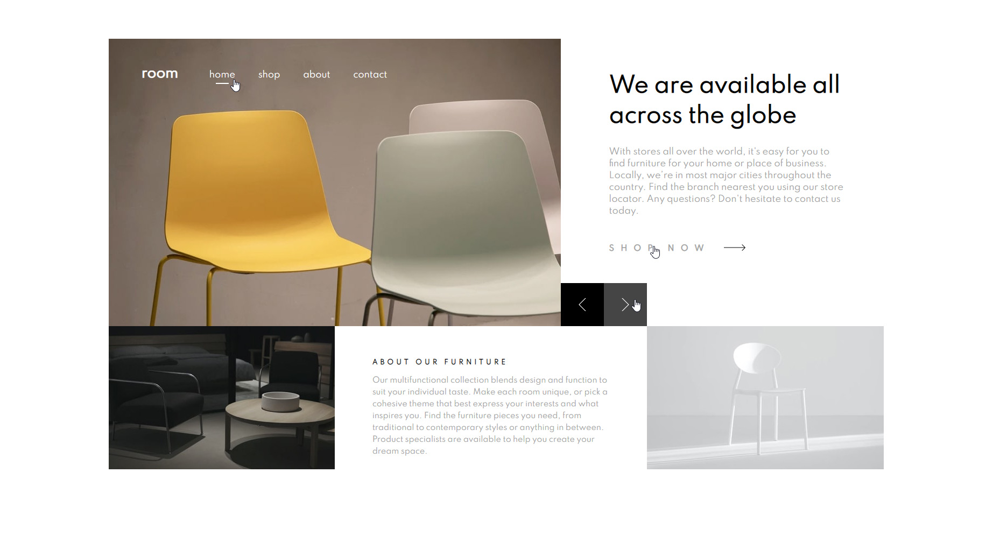

##  Ваши пользователи должны уметь: ##

- Просмотр оптимального макета сайта в зависимости от размера экрана устройства.(нет) 
- Просматривайте состояния наведения для всех интерактивных элементов на странице.(да) 
- Перемещайтесь по слайдеру с помощью мыши / трекпада или клавиатуры.(да) 
***
#  Процесс #  
- Html (div'ы)
- Css (flexbox'ы)
- JavaScript без библиотек (хочу для начала опробовать обычный js)  
*** 

##  Результат ## 

 